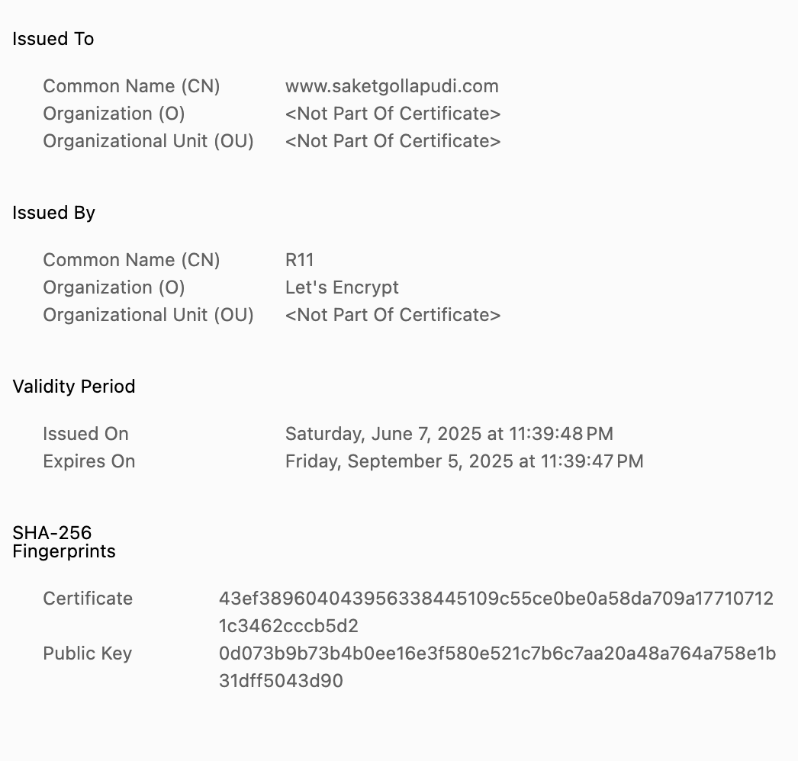

website: www.saketgollapudi.com 

Repo: https://github.com/saket1214/saket1214.github.io 

HTML insp. Googled for cool website templates and found this: https://www.w3schools.com/w3css/tryit.asp?filename=tryw3css_templates_cafe 

When I used the dig command on saketgollapudi.com (dig @8.8.8.8 saketgollapudi.com and dig saketgollapudi.com), I found that 8.8.8.8 returned the updated DNS information before my local DNS server. this is probably because public resolvers refresh their cache more frequently resulting in faster updates. 

Certificate: 

AI Prompts:

how to center website 
how to incorperate this font for website: https://fonts.google.com/specimen/Shadows+Into+Light 
how to do a bullet point list in html website 
how to add 6 photos in 3 by 2 layout for html site 
make photos all 16:9 vertical size 
how to make image enlarge when i hover over image 
how to add contact with instagram linkdin email logo 
how do i add a profile picture at begining of website, make it square 

